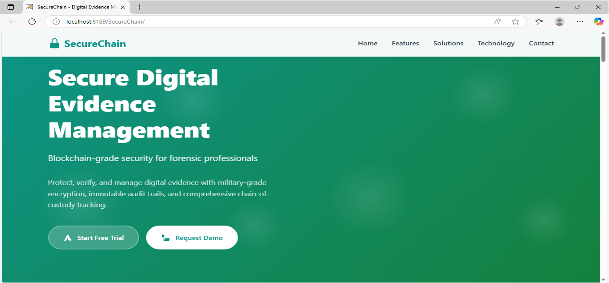
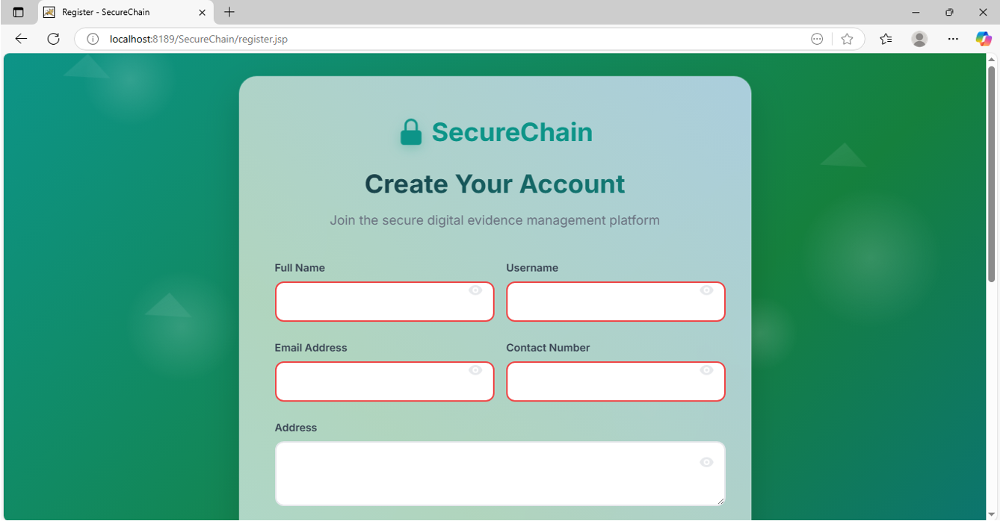
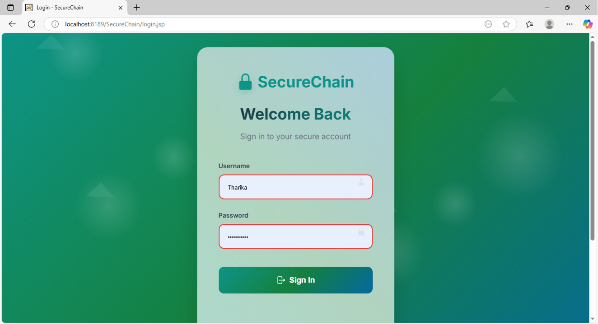

SecureChain – Digital Evidence Integrity & Chain-of-Custody System

SecureChain is a Java-based digital evidence preservation system developed during an IBM Internship. The project is designed to ensure the integrity, authenticity, and verifiability of digital evidence using cryptographic hashing techniques.

The system simulates real-world chain-of-custody workflows commonly used in cybersecurity, digital forensics, and legal investigations, enabling reliable tamper detection and evidence validation.


## Key Objectives

* Preserve the integrity of digital evidence
* Detect tampering using cryptographic hash comparison
* Simulate forensic chain-of-custody workflows
* Provide secure access through authentication mechanisms


## System Overview

SecureChain allows authenticated users to upload digital evidence files.
Each uploaded file is processed using the SHA-256 hashing algorithm, and the generated hash is stored as a permanent integrity record.

When a file is re-uploaded for verification, the system recalculates its hash and compares it with the stored value to determine whether the evidence has been altered.


## Technology Stack

* Backend: Java Servlets, java.security.MessageDigest
* Frontend: JavaServer Pages (JSP), HTML, CSS, JavaScript
* Database: MySQL
* Server: Apache Tomcat
* Database Connectivity: JDBC (MySQL Connector/J)


## Core Features

### Secure Authentication

* User registration and login functionality
* Passwords stored securely using SHA-256 hashing

### Evidence Upload

* Authenticated users can upload digital evidence files
* Files are stored securely on the server
* SHA-256 hash generated using HashUtil.java
* Hash records maintained for future verification

### Evidence Verification

* Users can re-upload files to verify integrity
* Verification outcomes:

  * VERIFIED – File integrity preserved
  * TAMPERED – Hash mismatch detected
  * NOT FOUND – No existing hash record available


## System Architecture

* Authentication Layer
* Secure File Upload Module
* SHA-256 Hashing Engine
* Integrity Verification Module
* MySQL-backed Metadata Storage


## Project Screenshots

### Main Landing Page


### User Registration Page


### User Login Page


### User Dashboard


### Evidence Records


## How to Run the Project

### Database Setup

* Ensure MySQL server is running
* Create a database named `securechaindb`
* Import the `securechaindb.sql` file to create required tables

### Server Setup

* Deploy the project on an Apache Tomcat server
* Add MySQL Connector/J (.jar file) to the Tomcat `lib` directory

### Configuration

Update database credentials in:

```
src/main/java/com/securechain/util/DBConnection.java
```

### Run

* Start the Tomcat server
* Access the application at:

```
http://localhost:8080/Secure_Chain/
```


## Future Enhancements

* Blockchain-based immutable hash ledger
* Role-based access control (RBAC)
* Timestamped evidence logging
* Audit trail visualization


## Contributers

Made By Diya Kharb


## Disclaimer

This project is intended for educational and academic purposes and demonstrates secure digital evidence handling concepts.
